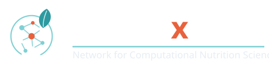

{ .nx-hero__logo }

# Computational methods for nutrition science, built in the open

NUTRIx is a network of early-career researchers working at the interface of
nutrition, epidemiology, and data science. We meet, learn, and build a shared,
openly licensed knowledge base of reproducible methods — so that good
computational practice becomes part of everyday nutrition research.

[Explore the knowledge base](getting-started/index.md){ .md-button .md-button--primary }
[Come to a meeting](meetings/index.md){ .md-button }
[Meet the network](about/members.md){ .md-button }

## Welcome

Nutrition science is being reshaped by digital tools and high-dimensional data —
digitised dietary records, continuous glucose and activity monitoring, metabolic
and inflammatory biomarkers, and multi-omics layers such as the microbiome and
metabolome. Making sense of these data takes computational skills that are still
rarely taught in nutrition programmes.

NUTRIx exists to close that gap. Our members first met at a 2024 spring school on
machine learning in nutrition and recognised a shared set of methodological
challenges. This site is where we work through them in public.

!!! tip "This is a living resource"
    The knowledge base grows at each network meeting. Pages are added,
    revised, and improved over time — and contributions from the wider community
    are welcome.

## What you'll find here

- :material-heart-pulse:{ .lg .middle } __Diet & Survival__

    ---

    Machine learning and survival analysis for dietary intake and time-to-event
    data: prediction versus causal inference, confounding and DAGs, substitution
    models, and N-of-1 designs.

    [:octicons-arrow-right-24: Area 1](research-areas/area-1-diet-survival/index.md)

- :material-recycle-variant:{ .lg .middle } __Reproducible ML__

    ---

    Transparency and rigour in ML-driven nutrition research: avoiding data
    leakage, estimating stability and uncertainty, clear documentation, and
    FAIR, shareable workflows.

    [:octicons-arrow-right-24: Area 2](research-areas/area-2-reproducible-ml/index.md)

- :material-graph:{ .lg .middle } __Multi-omics Integration__

    ---

    Integrative analysis of microbiome, metabolome, and other omics layers with
    dietary and phenotypic data: harmonisation, dimensionality reduction, and
    network-based interpretation.

    [:octicons-arrow-right-24: Area 3](research-areas/area-3-multiomics/index.md)

## Get involved

- :material-calendar-star:{ .lg .middle } __Join an in-person meeting__

    ---

    Each year the network hosts an in-person meeting on one of its three
    themes. The first two days are open to the wider nutrition and data
    science community — keynotes, expert talks, and hands-on workshops.

    [:octicons-arrow-right-24: Meetings & registration](meetings/index.md)

- :material-source-pull:{ .lg .middle } __Contribute a page__

    ---

    Tutorials, worked examples, and methodological notes are all welcome.
    Start with the contribution guide.

    [:octicons-arrow-right-24: How to contribute](getting-started/how-to-contribute.md)

---

<figure markdown="span">
  { width="300" }
  { width="300" }
  <figcaption>
    NUTRIx is funded by the Deutsche Forschungsgemeinschaft (DFG) as a Scientific
    Network. <a href="about/funding/">About the funding</a>.
  </figcaption>
</figure>
